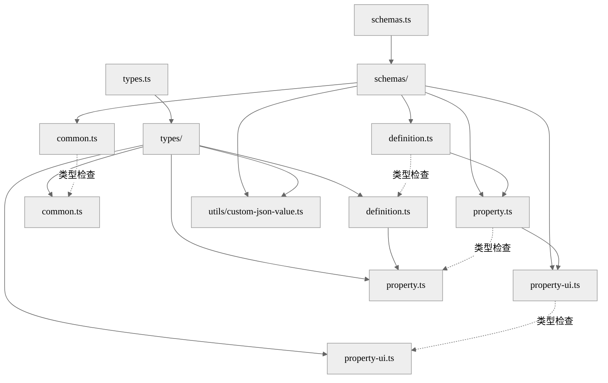
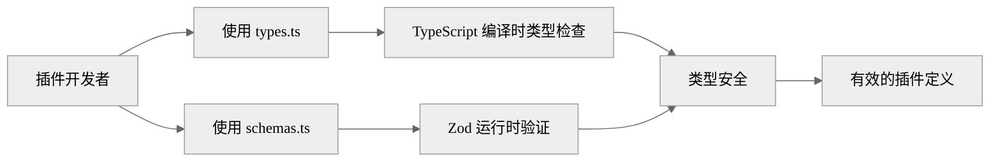
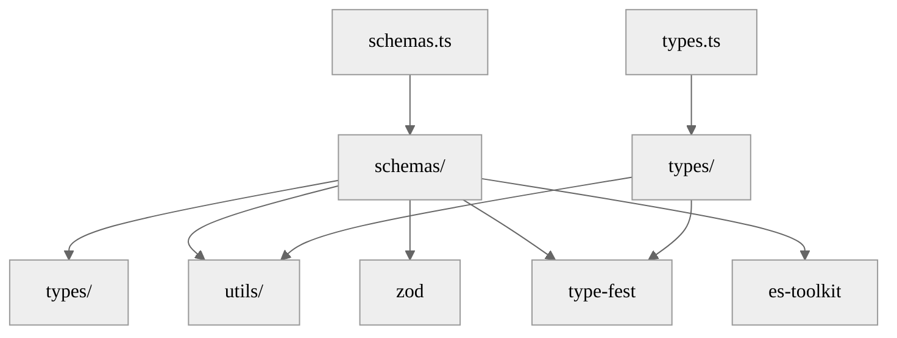

# 项目架构文档

**更新日期：** 2026-01-20

## 项目概述

`@choiceopen/atomemo-plugin-schema` 是一个用于开发 Choiceform atomemo 插件的 Schema 库。它提供了完整的 TypeScript 类型定义和 Zod Schema 验证，确保插件定义的类型安全和运行时验证。

## 主要功能

1. **类型定义：** 提供完整的 TypeScript 类型定义，支持插件、凭证、数据源、模型和工具的定义
2. **运行时验证：** 使用 Zod Schema 进行运行时验证，确保插件定义的格式正确
3. **国际化支持：** 内置国际化文本类型和验证，支持多语言插件
4. **属性系统：** 灵活的属性定义系统，支持多种数据类型和 UI 组件
5. **条件显示：** 支持基于其他属性值的条件显示逻辑

## 技术栈

- **TypeScript：** 类型定义和类型安全
- **Zod：** 运行时 Schema 验证
- **type-fest：** 工具类型库（`JsonValue`、`JsonObject`、`LiteralUnion`、`IntRange`、`IsEqual` 等）
- **es-toolkit：** 工具函数库（`isPlainObject`、`compact` 等）
- **Bun：** 运行时和测试框架
- **Biome：** 代码格式化和 Linting
- **tsdown：** TypeScript 构建工具

## 项目结构

```
atomemo-plugin-schema/
├── src/                    # 源代码目录
│   ├── schemas/           # Zod Schema 验证模块
│   │   ├── common.ts      # 通用 Schema（I18nEntrySchema）
│   │   ├── definition.ts  # 定义 Schema（Plugin, Credential, Model, Tool 等）
│   │   ├── property.ts    # 属性 Schema（String, Number, Boolean, Array, Object 等）
│   │   └── property-ui.ts # UI 组件 Schema
│   ├── types/             # TypeScript 类型定义模块
│   │   ├── common.ts      # 通用类型（I18nText）
│   │   ├── definition.ts  # 定义类型
│   │   ├── property.ts    # 属性类型
│   │   └── property-ui.ts  # UI 组件类型
│   ├── utils/             # 工具函数
│   │   └── custom-json-value.ts  # JSON 值 Schema 和类型
│   ├── schemas.ts         # Schema 统一导出
│   └── types.ts           # 类型统一导出
├── tests/                  # 测试目录
│   ├── schemas/           # Schema 验证测试
│   └── utils/             # 工具模块测试
├── dist/                  # 构建输出目录
├── .spec/                 # 架构文档目录
│   └── ARCHITECTURE.md    # 本文档
└── [配置文件]             # package.json, tsconfig.json, biome.json 等
```

## 模块架构

### 核心模块关系



### 数据流



### 模块依赖关系



## 核心概念

### 1. 插件定义（Plugin Definition）

插件定义是插件的元数据，包含：
- 基本信息：名称、显示名称、描述、图标
- 作者信息：作者名称、邮箱、仓库 URL、版本
- 支持的语言列表

### 2. 功能定义（Feature Definition）

功能定义包括：
- **Credential（凭证）：** 用于存储和管理认证信息
- **DataSource（数据源）：** 用于连接外部数据源
- **Model（模型）：** 用于定义 LLM 模型
- **Tool（工具）：** 用于执行特定功能

### 3. 属性系统（Property System）

属性系统是定义插件参数和设置的核心：

**属性类型：**
- `string`：字符串类型
- `number` / `integer`：数字类型
- `boolean`：布尔类型
- `array`：数组类型
- `object`：对象类型
- `discriminated_union`：区分联合类型
- `credential_id`：凭证 ID 类型
- `encrypted_string`：加密字符串类型

**属性特性：**
- 常量值（`constant`）
- 默认值（`default`）
- 枚举值（`enum`）
- 范围限制（`min_length`、`max_length`、`minimum`、`maximum`、`min_items`、`max_items`）
- 条件显示（`display.hide/show`）
- AI 配置（`ai.llm_description`）

### 4. UI 组件系统

每个属性类型可以配置不同的 UI 组件：

**字符串类型可用组件：**
- `input`、`textarea`、`code-editor`
- `select`、`radio-group`
- `emoji-picker`、`color-picker`、`credential-select`

**数字类型可用组件：**
- `number-input`、`slider`

**布尔类型可用组件：**
- `switch`

**数组类型可用组件：**
- `multi-select`、`tag-input`、`key-value-editor`、`slider`、`array-section`

**对象类型可用组件：**
- `collapsible-panel`、`json-schema-editor`、`conditions-editor`、`code-editor`

### 5. 条件显示系统

支持基于其他属性值的条件显示逻辑：

**操作符：**
- 比较操作符：`$eq`、`$ne`、`$gt`、`$gte`、`$lt`、`$lte`
- 存在性检查：`$exists`
- 集合操作：`$in`、`$nin`
- 正则匹配：`$regex`、`$options`
- 数组操作：`$size`、`$mod`
- 逻辑组合：`$and`、`$or`、`$nor`

## 设计模式

### 1. 类型与 Schema 分离

- **types/** 目录：TypeScript 类型定义，提供编译时类型检查
- **schemas/** 目录：Zod Schema 定义，提供运行时验证

这种分离的好处：
- 类型定义可以更灵活，不受 Zod 限制
- Schema 可以添加额外的验证逻辑
- 通过 `IsEqual` 工具类型确保两者一致

### 2. 类型安全验证

使用 `IsEqual` 工具类型确保 Schema 推断类型与 TypeScript 类型完全匹配：

```typescript
{
  const _: IsEqual<z.infer<typeof SomeSchema>, SomeType> = true
}
```

### 3. 递归 Schema

使用 `z.lazy()` 实现递归结构（如 `PropertyArray`、`PropertyObject`）：

```typescript
const PropertySchema: z.ZodType<Property> = z.lazy(() =>
  z.union([...])
)
```

### 4. 区分联合

使用 `z.discriminatedUnion()` 实现基于 `component` 字段的类型区分：

```typescript
export const PropertyUIPropsSchema = z.discriminatedUnion("component", [
  PropertyUIInputPropsSchema,
  PropertyUITextareaPropsSchema,
  // ...
])
```

### 5. 自定义验证

使用 `z.custom()` 实现复杂验证逻辑（如 `I18nEntrySchema`）：

```typescript
export const I18nEntrySchema = z.custom<I18nText>((value) => {
  // 自定义验证逻辑
})
```

## 导出结构

### 开发环境导出

```typescript
// package.json exports
{
  "./schemas": {
    "development": "./src/schemas.ts",
    "default": "./dist/schemas.js"
  },
  "./types": {
    "development": "./src/types.ts",
    "default": "./dist/types.js"
  }
}
```

在开发环境中，直接使用源代码，支持热重载和更好的调试体验。

### 生产环境导出

在生产环境中，使用构建后的 `dist/` 目录中的文件。

## 测试策略

### 测试覆盖

- **边界条件测试：** 重点测试 Schema 的边界条件和错误情况
- **类型安全验证：** 确保 Schema 推断类型与 TypeScript 类型匹配
- **完整覆盖：** 覆盖所有 Schema 的主要验证规则和边界情况

### 测试文件组织

- `tests/schemas/common.test.ts` - I18nEntrySchema 测试
- `tests/schemas/definition.test.ts` - Definition Schema 测试
- `tests/schemas/property.test.ts` - Property Schema 测试
- `tests/schemas/property-ui.test.ts` - Property UI Schema 测试
- `tests/utils/custom-json-value.test.ts` - JsonValueSchema 测试

## 构建和发布

### 构建流程

1. **类型检查：** `tsc --noEmit`
2. **代码格式化：** `biome check --write`
3. **构建：** `tsdown`（生成 `dist/` 目录）
4. **测试：** `bun test --dots`

### 发布流程

1. 运行 `prepublishOnly` 脚本（自动构建）
2. 发布到 npm（`publishConfig.access: "public"`）

## 待办事项和改进建议

### 短期改进

1. **文档完善：**
   - [ ] 添加更多使用示例
   - [ ] 添加 API 文档（使用 TypeDoc 或类似工具）
   - [ ] 添加迁移指南

2. **测试增强：**
   - [ ] 增加集成测试
   - [ ] 增加性能测试
   - [ ] 增加覆盖率报告

3. **开发体验：**
   - [ ] 添加 VS Code 代码片段
   - [ ] 添加更多 TypeScript 工具类型
   - [ ] 优化错误消息

### 长期改进

1. **功能扩展：**
   - [ ] 支持更多 UI 组件类型
   - [ ] 支持更多属性验证规则
   - [ ] 支持插件版本迁移

2. **性能优化：**
   - [ ] 优化大型 Schema 的验证性能
   - [ ] 优化类型推断性能
   - [ ] 减少包体积

3. **生态系统：**
   - [ ] 提供 CLI 工具用于验证插件定义
   - [ ] 提供插件模板生成器
   - [ ] 提供插件市场集成

## 相关文档

- [src/README.md](../src/README.md) - 源代码目录说明
- [src/schemas/README.md](../src/schemas/README.md) - Schema 模块说明
- [src/types/README.md](../src/types/README.md) - 类型模块说明
- [src/utils/README.md](../src/utils/README.md) - 工具模块说明
- [tests/README.md](../tests/README.md) - 测试目录入口
- [tests/OVERVIEW.md](../tests/OVERVIEW.md) - 测试总览与运行方式
- [tests/schemas/README.md](../tests/schemas/README.md) - Schema 测试目录入口
- [tests/schemas/OVERVIEW.md](../tests/schemas/OVERVIEW.md) - Schema 测试总览与已解决问题
- [tests/utils/README.md](../tests/utils/README.md) - utils 测试目录入口

## 贡献指南

1. 遵循项目的代码风格（使用 Biome 格式化）
2. 确保所有测试通过
3. 确保类型安全（使用 `IsEqual` 验证）
4. 更新相关文档
5. 提交前运行 `bun run check` 和 `bun run test`
